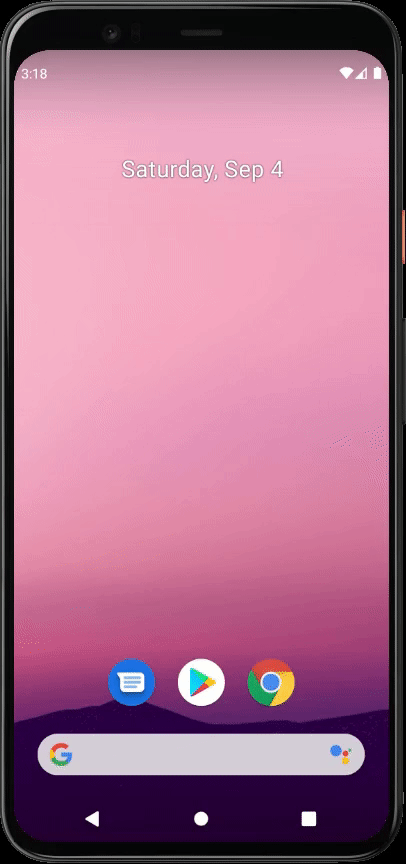

Application Description
======================
This application is hidden into the background in the initial loading state. When the button "volume down" is pressed 3 times consecutively, it will toggle the visibility of the app.

# Solution

In order to perform operations in background without a running activity I am using Android services.

## Volume Down Key Event

There are different ways to listen to media buttons’ callbacks but the one I have implemented is to register to a broadcast receiver (`VolumeChangedReceiver`) inside `BackgroundSoundService` that receives the volume changes.

```
class BackgroundSoundService : Service() {
  
      override fun onStartCommand(intent: Intent?, flags: Int, startId: Int): Int {
        ...
       
        broadcastReceiver = VolumeChangedReceiver()
        val filter = IntentFilter()
        filter.addAction(INTENT_ACTION_VOLUME_CHANGED)
        registerReceiver(broadcastReceiver, filter)
        
        ...
      }

}

```

`VolumeChangedReceiver`’s onReceive method gets triggered whenever you use the media buttons to change the media volume. However, I calculate the delta, the previous and current volume subtraction, to detect the “volume down” key event.

```
class VolumeChangedReceiver : BroadcastReceiver() {
      
      ...
  
      override fun onReceive(context: Context?, intent: Intent?) {
      
        val volumePrev = intent.getIntExtra(PREV_VOLUME_STREAM_VALUE, MAX_VOLUME)
        val volume = intent.getIntExtra(VOLUME_STREAM_VALUE, MAX_VOLUME)

        if (volumePrev > volume) {
          ...
          sendDataToActionReceiver(context = context)
          ...
        }

      }
      
      private fun sendDataToActionReceiver(context: Context?) {
        val serviceIntent = Intent(context, ActionReceiverService::class.java)
        serviceIntent.putExtra(CLICKED_THREE_TIMES_EXTRA, true)
        context?.startService(serviceIntent)
      }

}

```

It’s easier to detect “volume down” key event inside an activity. The activity's `onKeyDown` method is used to access the volume down button.

```
    override fun onKeyDown(keyCode: Int, event: KeyEvent?): Boolean {
        if (keyCode == KeyEvent.KEYCODE_VOLUME_DOWN) {
        
        }
        return false
    }

```

## Hiding app in the Initial Loading State

To launch the application without a visible activity I am using a `Translucent` theme in the `AndroidManifest` file.

Also my `MainActivity` class is extending from `Activity` instead of `AppCompatActivity` and the reason is that the Translucent theme is not a type of AppCompat theme.

When launching the activity for the first time I start the background service and finish the activity.

# Challenges

### Accessing Media Key Events in Backgorund

As far as I know accessing media buttons when there is no activity running is challenging and you will need to find a creative workaround for this.

### Invisible Launcher Activity

By default android apps use activities to launch and hiding this in the initial state is a bit tricky.

# Application Demo


